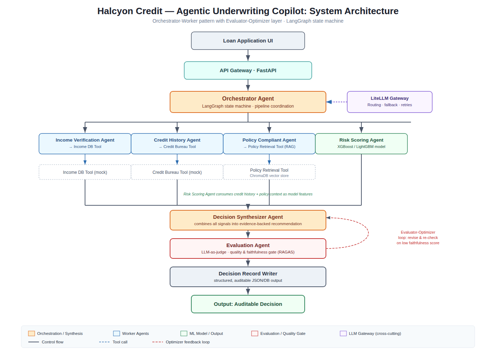

<div align="center">

# 🏦 Halcyon Credit — Agentic Underwriting Copilot

### Auditable, explainable, fair lending decisions — produced by a team of cooperating AI agents, not a black box.

[](./PROGRESS.md)
[](./ROADMAP.md)
[](https://www.python.org/)
[](https://langchain-ai.github.io/langgraph/)
[](https://docs.litellm.ai/)
[](https://www.trychroma.com/)
[](https://docs.ragas.io/)
[](./LICENSE)

**Team Jamun** · Harshit · Ayush · Aditya · Himkar
Futurense × IIT Gandhinagar · PG Diploma in AI-ML & Agentic AI Engineering · Capstone Project 02

[Problem](#-the-problem) · [Solution](#-the-solution) · [Why it's different](#-why-its-different) · [Architecture](#%EF%B8%8F-architecture) · [How it works](#-how-it-works) · [Evaluation](#-evaluation--metrics) · [Quickstart](#-quickstart) · [Roadmap](#-roadmap) · [Docs](#-documentation)

</div>

---

> [!NOTE]
> **Project status — active development.** The design phase is complete and high-fidelity:
> a build-ready [TRD](./TRD.md), a [PRD](./PRD.md) with metrics and personas, a [prior-art review](./research_market_review.md),
> and the architecture diagrams below. Implementation is now underway (see the [Roadmap](#-roadmap) and live [Progress board](./PROGRESS.md)).
> Commands in [Quickstart](#-quickstart) describe the **target** developer experience as the pipeline lands.

---

## 📌 The Problem

**Halcyon Credit** is a (fictional) digital consumer lender serving many applicants with **thin or non-traditional credit histories**. Applications arrive faster than human underwriters can process them. Each file holds structured data — income, debts, bureau records, prior applications, a stated loan purpose — and a human underwriter must read it, cross-check the numbers, weigh the risk, apply policy, and write a decision with reasons. This is careful, slow, and unscalable.

The hard constraint: **Halcyon cannot ship a black box.** A lender must

- **explain** every decline to the applicant (adverse-action requirements),
- **defend** every decision to a regulator, and
- **treat all applicants fairly** across segments.

A bare risk score — even an accurate one — does none of this.

## 💡 The Solution

An **Agentic Underwriting Copilot**: a team of specialised AI agents that mirror the full human underwriting workflow and return an **evidence-backed, faithful, auditable recommendation** (`APPROVE` / `DECLINE` / `REFER`) for a human underwriter — within a measured cost budget.

The pipeline **assembles** the applicant file → **verifies** income and credit → **scores** repayment risk (with SHAP attribution) → **checks** the decision against lending policy via RAG → **synthesises** a written recommendation that cites its evidence → **evaluates** that recommendation for faithfulness before output → and **records** a fully replayable audit trail.

> The deliverable is the **agentic reasoning, verification, policy, and evaluation layer** — the risk model is a commodity component, not the headline.

## 🔍 Why It's Different

We studied three production-grade systems (full teardown in [`research_market_review.md`](./research_market_review.md)). Each nails part of the problem; none combines all of it in a pipeline an early-stage lender can own and have reviewed from first principles.

| Capability | Upstart | Zest AI | Agentic APA (AA / AWS) | **Halcyon Copilot** |
|---|:---:|:---:|:---:|:---:|
| Thin-file borrower coverage | ✅ | ✅ | ◑ | ✅ |
| ML risk scoring | ✅ | ✅ | ◑ | ✅ |
| SHAP / feature attribution | ◑ | ✅ | ◑ | ✅ |
| Fairness testing across segments | ◑ | ✅ | ◑ | ✅ |
| **Policy compliance via RAG** | ❌ | ❌ | ❌ | ✅ |
| **LLM-synthesised written reasons** | ❌ | ❌ | ◑ | ✅ |
| **Faithfulness evaluation loop** | ❌ | ❌ | ◑ | ✅ |
| Stateful, replayable audit trail | ◑ | ◑ | ✅ | ✅ |
| Open-stack, self-hostable | ❌ | ❌ | ❌ | ✅ |

## 🏗️ Architecture

An **Orchestrator-Worker** pattern with a nested **Evaluator-Optimizer** loop, implemented as a **LangGraph** state machine behind a **FastAPI** gateway. All LLM calls route through a **LiteLLM** gateway for routing, fallback, retries, and per-call cost logging.



Worker agents (Income, Credit, Policy) run **in parallel**; a synchronisation barrier merges their results before Risk Scoring fires (state-gated, never speculative). The Decision Synthesizer drafts a recommendation; the Evaluation Agent judges its faithfulness, and on a low score routes back with feedback — capped at *N* retries, after which the case is escalated to a human queue. Every node transition is **checkpointed**, giving a complete, replayable audit history.

📐 Full diagrams: [system architecture](01_system_architecture.png) · [execution sequence (LLD)](02_sequence_flow.png) · [state schema & contracts](03_state_schema.png) · spec in the [TRD](./TRD.md).

### The agent team

| Agent | Responsibility | Tool / Model |
|---|---|---|
| 🧭 **Orchestrator** | Coordinates the pipeline; owns shared `ApplicationState` | LangGraph state machine |
| 💰 **Income Verification** | Verifies applicant income from source data | Income DB Tool |
| 📊 **Credit History** | Fetches bureau records & credit profile | Credit Bureau Tool |
| 📜 **Policy Compliance** | Retrieves & checks lending policy clauses | Policy Retrieval (ChromaDB + RAG) |
| ⚖️ **Risk Scoring** | Repayment risk from typed features + SHAP | XGBoost / LightGBM |
| ✍️ **Decision Synthesizer** | Combines signals into a cited recommendation | LLM (strong path) |
| 🔎 **Evaluation** | Judges faithfulness & quality; gates output | LLM-as-Judge + RAGAS |
| 🗄️ **Decision Record Writer** | Persists the full state trace immutably | Postgres / SQLite |

## 🛠️ Tech Stack

| Layer | Technology |
|---|---|
| Agent orchestration | **LangGraph** (stateful, checkpointed) |
| LLM gateway | **LiteLLM** (routing · fallback · retries · cost log) |
| API | **FastAPI** (async) |
| Policy RAG | **ChromaDB** + sentence-transformers |
| Models | Gemini Flash (cheap path) · stronger model (synthesis/judge) |
| Risk model | **XGBoost / LightGBM** + SHAP |
| Evaluation | **RAGAS** · **DSPy** · LLM-as-Judge |
| Persistence | Postgres / SQLite (immutable decision records) |
| CI/CD | GitHub Actions + golden-set gate |

## ⚙️ How It Works

A single typed `ApplicationState` object threads through every node. Each agent **reads only its declared inputs and writes only its declared outputs** — enforced by Pydantic validators, not convention — so no agent can corrupt another's state.

```
POST /applications
      │
 init_state
      ├──► verify_income ─┐
      ├──► fetch_credit  ─┤  parallel fan-out
      └──► check_policy  ─┘
            merge_state            (await all three)
                │
            score_risk             (state-gated: runs only when all inputs present)
                │
            synthesize ◄───────────┐
                │                  │ retry with judge feedback (max N)
            evaluate ──────────────┘
                │  pass
            write_record  ──►  Auditable Decision (JSON + DB) + audit_id
```

Grounding is mandatory: every worker output carries `source_refs`, and every reason in the final decision cites a source field or policy clause ID. Unsupported claims are treated as bugs and caught by the Evaluation Agent.

## 📊 Evaluation & Metrics

Our north star is the **Trusted Decision Rate (TDR)** — the share of applications whose recommendation is simultaneously **correct**, **faithful**, **policy-compliant**, *and* **within budget**. A decision only counts if it would survive both a regulator and the CFO.

| Metric | Target | Why it matters |
|---|---|---|
| 🎯 **Trusted Decision Rate** (north star) | ≥ 70% | Joint quality — no cherry-picking |
| Decision Quality (vs ground truth) | ≥ 85% | Accuracy |
| Explanation Faithfulness (RAGAS / judge) | ≥ 0.80 | Reasons match the evidence |
| Fairness gap across segments | < 5 pp | No disparate impact |
| Policy adherence (hard-stop violations) | 0 | Regulatory safety |
| Cost per application | ≤ $0.10 (measured) | Unit economics |
| Latency p95 | ≤ 30 s | Throughput |

**Evaluation philosophy — honesty over optics.** We build a **single-LLM baseline** alongside the agentic system and report the delta *honestly*, positive or negative. We **calibrate** the LLM-as-Judge against human labels before trusting it, run **fairness** and **adversarial/red-team** suites every evaluation, and gate every merge on a **golden set** of ≥100 ground-truth cases.

## 🛡️ Responsible AI

- **Explainability** — every output ships written reasons + SHAP-attributed risk drivers; declines meet adverse-action standards.
- **Fairness** — segment approval/error-rate gaps measured every run; protected attributes are *measurement* variables, never model inputs.
- **Auditability** — the complete `ApplicationState` trace is persisted immutably and is fully replayable for regulatory review.
- **Human-in-the-loop** — this is a *copilot*: recommendations, not binding decisions; retry-exhaustion forces human escalation.
- **Privacy & secrets** — no applicant PII in prompt logs; zero secrets in source (env vars only); dependency + secret scanning in CI.

See the [Risk Register](./docs/risk_register.md) for the full risk/mitigation matrix.

## 📁 Repository Structure

```
Credit-Decision-Intelligence/
├── README.md                     ← you are here
├── CLAUDE.md                     ← operating contract for every contributor/session
├── PROGRESS.md  DECISIONS.md  ROADMAP.md  EVALUATION_GAP_ANALYSIS.md   ← living governance
├── PRD.md  TRD.md  research_market_review.md                          ← design & research
├── 01_system_architecture.png  02_sequence_flow.png  03_state_schema.png
├── docs/            risk_register.md · runbook.md
├── data/            dataset_card.md  (synthetic generator, EDA — incoming)
├── .github/workflows/ci.yml
├── agents/  tools/  gateway/  api/  state/  eval/  ui/  tests/        ← build targets (TRD §9.1)
├── requirements.txt  pyproject.toml  Makefile  .env.example  CODEOWNERS
└── LICENSE  CONTRIBUTING.md  SECURITY.md  CHANGELOG.md
```

## 🚀 Quickstart

> **Target developer experience** as the pipeline lands (Sprint 2). Tracked in [ROADMAP.md](./ROADMAP.md).

```bash
# 1. Clone
git clone https://github.com/harshit234/Credit-Decision-Intelligence.git
cd Credit-Decision-Intelligence

# 2. Set up the environment
make setup                 # creates venv + installs requirements
cp .env.example .env       # add your LLM gateway keys (never commit .env)

# 3. Run the API
make run                   # FastAPI at http://localhost:8000  (/docs for OpenAPI)

# 4. Score one application
curl -X POST localhost:8000/applications -H "Content-Type: application/json" -d @examples/application.json

# 5. Reproduce the evaluation
make eval                  # golden set → RAGAS + fairness + agentic-vs-baseline report
```

## 🗺️ Roadmap

| Sprint | Theme | Focus |
|---|---|---|
| 0 | Discover & Define | Dataset profiling, personas, PRD, risk register |
| 1 | Design & De-risk | Architecture, agent contracts, synthetic data, golden set, Policy-RAG spike |
| 2 | Build the Core | End-to-end pipeline, gateway live, first cost baseline |
| 3 | Harden & Optimize | Full agent set, RAGAS, DSPy, fairness, adversarial, regression gate |
| 4 | Verify & Operate | Agentic-vs-baseline benchmark, deploy, runbook, demo, viva |

Full, owner-assigned sequencing in [`ROADMAP.md`](./ROADMAP.md); current state in [`PROGRESS.md`](./PROGRESS.md).

## 🧭 How We Work (Governance)

This repo is **self-documenting and self-evolving**. Every contributor and AI session reads [`CLAUDE.md`](./CLAUDE.md) (the operating contract), advances a rubric bucket, then updates [`PROGRESS.md`](./PROGRESS.md) and logs decisions as ADRs in [`DECISIONS.md`](./DECISIONS.md). The repo — not chat history — is the source of truth. See [`CONTRIBUTING.md`](./CONTRIBUTING.md).

## 📚 Documentation

| Document | What's inside |
|---|---|
| [PRD.md](./PRD.md) | Problem, personas, scope, metrics, risk register |
| [TRD.md](./TRD.md) | Agent contracts, state schema, tool specs, gateway, CI, SLOs |
| [research_market_review.md](./research_market_review.md) | Upstart / Zest AI / Agentic APA teardown + gap analysis |
| [EVALUATION_GAP_ANALYSIS.md](./EVALUATION_GAP_ANALYSIS.md) | Evaluator-POV review vs the grading rubric |
| [ROADMAP.md](./ROADMAP.md) · [PROGRESS.md](./PROGRESS.md) · [DECISIONS.md](./DECISIONS.md) | Living plan, status, decisions |
| [docs/risk_register.md](./docs/risk_register.md) · [docs/runbook.md](./docs/runbook.md) | Risks & operations |
| [data/dataset_card.md](./data/dataset_card.md) | Dataset source, license, schema, fairness notes |

## 👥 Team Jamun

| Member | Lane |
|---|---|
| **Harshit** | Risk Scoring + dataset / EDA + model card |
| **Aditya** | Orchestrator + LangGraph graph + persistence + API |
| **Ayush** | Policy Compliance + ChromaDB RAG + Faithfulness / RAGAS evaluation |
| **Himkar** | LiteLLM gateway + routing/cost + Synthesizer + DSPy |

*Futurense × IIT Gandhinagar · PG Diploma in AI-ML & Agentic AI Engineering · Cohort 1*

## 📜 License

Built for academic and portfolio purposes under the Futurense AI Clinic Capstone Program. See [LICENSE](./LICENSE).

---

<div align="center">

*Halcyon Credit is a fictional persona created for this engagement. No real lending decisions are made by this system.*

**If a decision can't be explained, it shouldn't be made.**

</div>
